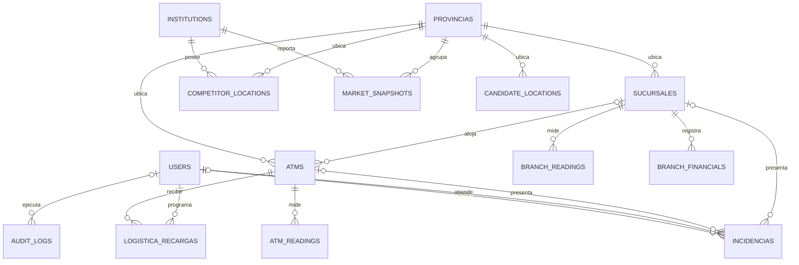

# Modelo relacional

## Tablas

| Tabla | Responsabilidad y claves |
|---|---|
| `users` | UUID, correo normalizado único, Bcrypt, rol, activación, versión JWT, bloqueo temporal |
| `provincias` | Catálogo de provincia/región; población, área y fuente opcionales |
| `sucursales` | Código único, provincia FK, dirección, coordenadas, estado, capacidad de atención y objetivo SLA |
| `atms` | Código único, sucursal opcional, provincia propia, tipo, efectivo, capacidad, estado, comunicación y mantenimiento |
| `incidencias` | Un ATM **o** una sucursal; severidad, responsable, apertura, resolución y cierre |
| `logistica_recargas` | Orden CIT con referencia única, ATM, montos, transportadora y fechas |
| `atm_readings` | Contadores por ATM/hora: transacciones, retiros, efectivo, segundos observados/disponibles/utilizados |
| `branch_readings` | Contadores por sucursal/hora: visitantes, atendidos, SLA, espera acumulada, cajeros y cola |
| `branch_financials` | Saldo de depósitos y préstamos por sucursal/fecha |
| `institutions` | Entidades de la matriz comparativa; solo una puede marcarse como propia |
| `competitor_locations` | Puntos geográficos de competencia, código por entidad, tipo, fuente y verificación |
| `market_snapshots` | Corte por entidad/provincia/fecha con sucursales, ATMs, saldos y actividad |
| `candidate_locations` | Ubicaciones propuestas, puntuación, densidad, fuente y estado de evaluación |
| `audit_logs` | Actor, operación, entidad, fecha y valores antes/después, excluyendo secretos |

## Reglas operativas

- Los ATMs independientes conservan provincia, municipio y coordenadas para participar en filtros y mapas. La provincia de un ATM asociado debe coincidir con la sucursal al crearlo.
- El efectivo tiene rango 0–100 y capacidad positiva. `BAJO_EFECTIVO` se calcula al escribir para estados que pueden operar, usando el umbral configurable (20% por defecto). Registrar efectivo no elimina una avería ni mantenimiento.
- Las fechas operativas son `timestamptz`. Los endpoints de entrada exigen zona horaria. Las lecturas corresponden a horas completas y ya terminadas; una clave única impide contar dos veces un ATM/sucursal en una hora.
- Los contadores de uptime cumplen `utilizado <= disponible <= observado <= 3600`. Los de atención cumplen `clientes_dentro_sla <= clientes_atendidos`; la espera acumulada corresponde a los clientes atendidos en esa hora, incluidos los que llegaron antes.
- Cada incidencia apunta a exactamente un recurso. Al asignarla pasa a `EN_PROCESO`; el cierre exige resolución y fecha generada por el servidor. Los registros cerrados no se reabren mediante esta API.
- CIT permite `PROGRAMADA → EN_TRANSITO → COMPLETADA`; se puede cancelar desde los dos primeros estados. La finalización requiere monto real y porcentaje de efectivo medido. Se bloquean la orden y el ATM durante la transacción y se rechaza una segunda ejecución.
- Las eliminaciones de recursos relacionados están restringidas. La API conserva el historial; sucursales y usuarios se desactivan/cambian de estado.
- La auditoría comparte la transacción de la escritura; no hay endpoints para editarla o eliminarla. Es trazabilidad de aplicación, no un archivo externo inmutable.

## Semántica de indicadores

| Indicador | Cálculo |
|---|---|
| Disponibilidad actual | ATMs `OPERATIVO` o `BAJO_EFECTIVO` / inventario filtrado |
| Uptime histórico | Suma de segundos disponibles / suma de segundos observados |
| Utilización ATM | Suma de segundos utilizados / suma de segundos disponibles |
| Cobertura | Provincias con presencia / provincias del catálogo filtrado; no mide población cubierta ni superficie |
| Espera media | Espera acumulada / clientes atendidos / 60; ponderada por clientes |
| SLA | Clientes atendidos dentro del objetivo / total atendido |
| Utilización de cajeros humanos | Segundos ocupados / segundos disponibles acumulados |
| Tráfico horario | Visitantes acumulados para cada hora local dentro del periodo |
| Depósitos/préstamos propios | Último saldo de cada sucursal hasta `hasta`; nunca se suman días de saldos |
| Comparativa | Última fecha de corte común disponible hasta `hasta`; no se arrastran datos anteriores de entidades ausentes |
| Cuota de depósitos de la muestra | Depósitos de una entidad / depósitos reportados por todas las entidades en ese corte |
| Utilización comparativa | Media ponderada por cantidad de ATMs con utilización reportada |
| Competidores cercanos | Conteo de puntos dentro de un radio geodésico configurable, por defecto 5 km |
| Potencial de mercado | Puntuación 0–100 proporcionada con una fuente; no se presenta como una predicción automática |

Los cocientes sin denominador devuelven `null`. Los periodos sin lecturas no se rellenan con ceros. Los metadatos indican fechas, moneda y zona horaria. Una muestra parcial no equivale a todo el mercado: los resultados comparativos incluyen fuentes y provincias reportadas. El catálogo regional usa una agrupación interna, no una clasificación estadística oficial.

El histórico registra horas con observaciones; los huecos no se consideran automáticamente tiempo operativo ni caído. Las lecturas tardías no actualizan `ultima_comunicacion`: esta solo cambia con `POST /atms/{id}/heartbeat`. La actualización manual y una recarga no simulan una conexión del equipo.
